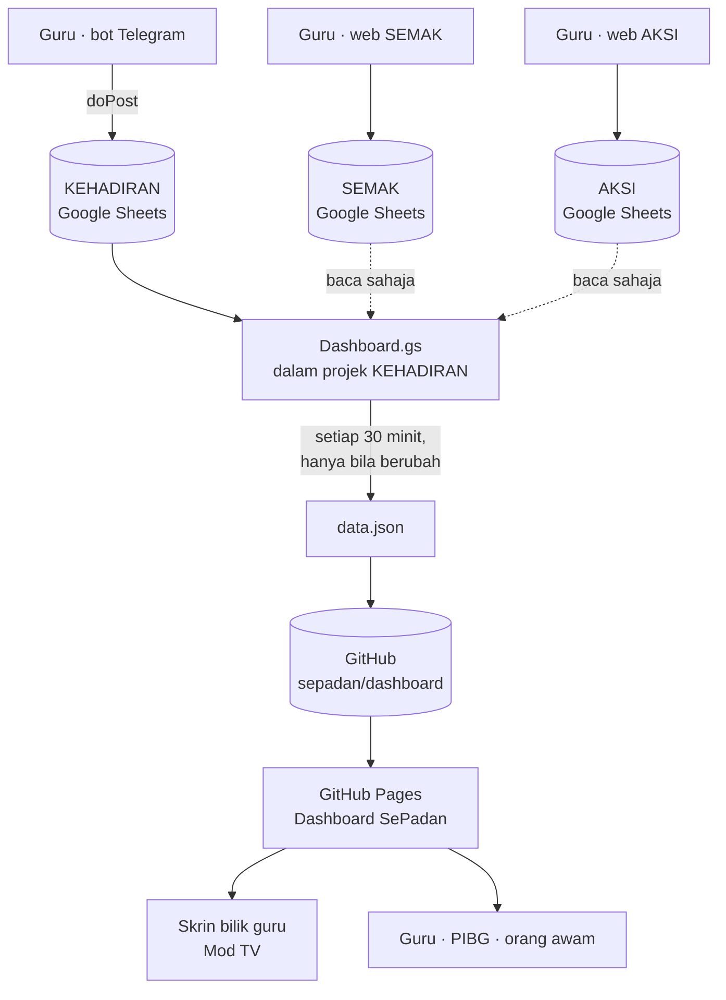

# Blueprint Ekosistem Data SK Paya Redan

**Versi 1.5 · 23 Ogos 2026**

Dokumen ini ialah **sumber kebenaran tunggal** bagi seluruh ekosistem. Ia ditulis supaya sesiapa — manusia atau AI — boleh meneruskan kerja pada sistem ini tanpa perlu membaca sejarah perbualan.

> **Kepada AI yang membaca ini:** [`CLAUDE.md`](CLAUDE.md) mengikat cara kerja pada repo ini — baca sekali. Kemudian baca bahagian *Peraturan yang tidak boleh dilanggar* di bawah sebelum menulis sebarang kod. Beberapa keputusan di sini kelihatan seperti kesilapan tetapi sebenarnya betul, dan pernah dibetulkan sekali. Kemas kini dokumen ini setiap kali sistem berubah — lihat *Protokol penyelenggaraan* di hujung.

---

## 1. Gambaran keseluruhan

Empat sistem berasingan. Tiga mengumpul data, satu memaparkannya.



**Prinsip utama:** setiap sistem memiliki datanya sendiri. Dashboard **tidak pernah menulis** ke mana-mana sistem — ia hanya membaca dan menerbitkan angka agregat.

---

## 2. Komponen

### 2.1 KEHADIRAN — sistem induk

| | |
|---|---|
| Spreadsheet | `16QZX5IYTUeQiYp9co2yXW5VQfgcY0J7_zPrDCygPbLk` |
| Apps Script | `1ZtYVu89oE667IacRva0z1-GuxzzoyjeJyUyXian0_lSOReL14WctfcJi` |
| Pemilik | `sekolah-3458-cm1@moe-dl.edu.my` (delima) |
| Editor | `barukulamamu@gmail.com` |
| Perkongsian | Restricted |
| Repo kod | privat — `sistem-kehadiran-sepadan` |

Sistem ini menjadi **tuan rumah** bagi `Dashboard.gs`. Semua penjanaan `data.json` berlaku di sini.

**Tab:**

| Tab | Peranan |
|---|---|
| `main` | Senarai murid aktif. **Senarai rasmi sekolah** — semua sistem lain disemak terhadapnya |
| `kehadiran` | Satu baris satu murid, satu lajur satu tarikh. `1` hadir · `0` tidak hadir · `—` bukan murid sekolah pada tarikh itu |
| `rmt` | Status penerima Rancangan Makanan Tambahan |
| `arkib_murid` | Tempoh murid tidak aktif `[mula, tamat)` |
| `jantina` | Peta IC → L/P |
| `tetapan_dashboard` | Tetapan dashboard — lihat 4.1 |
| `dash_*` | Data manual pilihan; kosong bermakna "ambil dari sistem luar" |
| `<KELAS>_<BULAN>` | Tab bulanan dijana automatik |

**Susunan lajur `main` (11 lajur teras):**

```
0 BIL · 1 ID MURID · 2 NAMA · 3 NO. PENGENALAN · 4 JENIS PENGENALAN
5 TARIKH LAHIR · 6 STATUS · 7 TARIKH MASUK · 8 TARIKH MASUK KELAS
9 TAHUN/TINGKATAN · 10 NAMA KELAS
```

Lajur 11 ke atas datang dari MOEIS (JANTINA, KAUM, OKU, YATIM, pendapatan penjaga, dsb.) dan dipetakan mengikut **nama tajuk**, bukan kedudukan.

> ⚠️ **Jangan sort tab `main` secara manual.** Skrip menyusunnya sendiri semasa upload dan menulis semula 11 lajur mengikut susunan itu. Pernah berlaku: nama bergerak tetapi lajur MOEIS kekal, menyebabkan 41% rekod tidak sejajar. Gunakan **🔍 Semak Sejajaran Tab Main** untuk mengesahkan.

### 2.2 SEMAK — markah peperiksaan

| | |
|---|---|
| Spreadsheet | `1Manu3uoLZNZpOn2_qQZ_6CAm25Qik1ddWHGyFN9UD1M` |
| Nama fail | *Sistem Markah SKPR (UPSA)* |
| Pemilik | `barukulamamu@gmail.com` · delima ialah editor |
| Antara muka | Apps Script web app |

**Tab yang dibaca dashboard:** `MARKAH` sahaja (dan `TETAPAN!B4` untuk peperiksaan aktif).

```
MARKAH:  0 PEPERIKSAAN · 1 KELAS · 2 NAMA MURID · 3 SUBJEK · 4 MARKAH
         5 TP · 6 GURU · 7 DIKEMASKINI · 8 IC MURID
```

### 2.3 AKSI — kokurikulum

| | |
|---|---|
| Spreadsheet | `1ElBfhTcj1pcxYS6hA2mzTfEeX5udCskODnNdqU7G_dM` |
| Apps Script | `1a-_G8leFyeftmf4jUB5JURZbZGYlmqlyKgRHm7H8sdqbFGXX5GFDwskK` |
| Pemilik | `sekolah-3458-cm1@moe-dl.edu.my` (delima) |

> ⚠️ **Ada DUA projek Apps Script bernama "AKSI".** Yang hidup ialah
> `1a-_G8le…` pada akaun `/u/0`. Satu lagi, `1ABvFqRhcKqagxvanG9jhOJUF4y4e8Zl…`
> pada akaun `/u/1`, tiada pemicu dan nampaknya tidak digunakan.
> **Sentiasa sahkan ID projek sebelum menampal patch** — menampal ke projek yang
> salah menghasilkan kod yang kelihatan betul tetapi tidak pernah dijalankan.
| Repo kod | awam — `sepadan/aksi` (kod sahaja, tiada data) |
| Antara muka web | `sepadan/aksi` → `docs/` di GitHub Pages |

**Antara muka web AKSI sudah dibina dan BERFUNGSI DALAM PRODUKSI.** Log masuk dari `https://sepadan.github.io/aksi/` disahkan berjaya pada 23 Ogos 2026 — bermakna patch Apps Script (`Auth.gs`, `WebBackend.gs`, dan `getIdentitiAwam`/`getSidebarData` dalam `API_DIBENARKAN`) semuanya sudah masuk ke deployment sebenar, dan CORS merentas asal berfungsi seperti dirancang. Sepuluh halaman statik dalam `docs/`, dengan `js/api.js` sebagai *shim*: ia menggantikan `google.script.run` dengan `fetch` POST ke `/exec` menggunakan `Proxy`, `Content-Type: text/plain` (elak preflight CORS) dan `redirect: follow`. Halaman-halaman itu memanggil `google.script.run` seperti biasa tanpa perlu diubah — corak yang kemas.

`docs/js/config.js` ialah satu-satunya tempat URL `/exec` ditetapkan.

**Tab yang dibaca dashboard:**

| Tab | Lajur yang digunakan |
|---|---|
| `KEAHLIAN` | `IC`, `ID_KELAB`, `KATEGORI`, `TAHUN_AKADEMIK`, `STATUS` |
| `KELAB` | `ID_KELAB`, `NAMA_KELAB`, `KATEGORI`, `JENIS_KELAB` |
| `PENCAPAIAN` | `IC`, `PERINGKAT`, `TAHUN_AKADEMIK` |
| `MURID_MASTER` | `IC`, `STATUS` — sandaran penyebut sahaja |

Lajur dibaca **mengikut nama tajuk**, bukan kedudukan. AKSI masih dalam pembangunan; menyusun semula lajur tidak akan memecahkan penyambung.

**Data AKSI yang BELUM digunakan** (peluang penambahbaikan): `PERJUMPAAN`, `KEHADIRAN`, `LAPORAN_PERJUMPAAN`, `PENILAIAN_KOKU`, `KOMITMEN_DETAIL`, `EKSTRA_KURIKULUM`, `PAJSK_SUMMARY`.

### 2.3b Repo awam yang lain

| Repo | Kandungan | Nota |
|---|---|---|
| `sepadan/semak` | `index.html` (iframe) + `src/` (5 fail) | Aplikasi SEMAK versi statik |
| `sepadan/aksi` | kod Apps Script di akar + `docs/` | Lihat 2.3 |

`sepadan/semak/index.html` ialah cangkerang 594 bait yang meng-*iframe* `src/App.html`. Ia menggunakan corak *shim* yang sama seperti AKSI.

### 2.4 DASHBOARD — paparan

| | |
|---|---|
| Repo | `sepadan/dashboard` — **AWAM** |
| Laman | `https://sepadan.github.io/dashboard/` |
| Fail | `index.html` (aplikasi) · `data.json` (data) |

Satu fail HTML, tiada kebergantungan luar, carta SVG ditulis tangan. Berfungsi luar talian jika `data.json` dimuat secara manual.

Enam tab: Ringkasan · Enrolmen · Kehadiran · Akademik · HEM · Kokurikulum.
Ditambah **Mod TV** (slaid automatik satu skrin penuh, 15–16 muka, tukar setiap 18 saat) dan **Laporan ringkas** 2 muka A4 untuk cetakan.

---

## 3. Peraturan yang tidak boleh dilanggar

Setiap satu di sini pernah salah sekali dan sudah dibetulkan. Jangan "kemas kini" tanpa membaca sebabnya.

### 3.1 Privasi — sempadan paling penting

**Repo `sepadan/dashboard` adalah AWAM.** `data.json` hanya boleh mengandungi **angka agregat**.

Tidak boleh, dalam apa keadaan sekalipun:

- nama murid
- nombor kad pengenalan
- markah individu
- butiran penjaga, alamat, pendapatan
- senarai nama murid tidak hadir

Kehadiran hari ini memaparkan **bilangan sahaja** (`14 tidak hadir · 3 Bijak: 5`). Ini keputusan sedar, bukan kekurangan. Senarai nama kanak-kanak yang tiada di rumah pada waktu pagi, dikemas kini setiap 30 minit di internet awam, adalah risiko sebenar. Guru melihat nama dalam Telegram dan spreadsheet.

Ujian `uji-aksi.js` mengandungi semakan khusus bahawa tiada IC (12 digit) dan tiada nama murid muncul dalam output. **Kekalkan ujian itu.**

### 3.2 Kokurikulum hanya Tahun 3–6

```
DASH_KOKU_TAHUN_MIN = 3
DASH_KOKU_TAHUN_MAX = 6
```

Prasekolah, Tahun 1 dan Tahun 2 **tidak layak** menyertai kokurikulum. Memasukkan mereka ke dalam penyebut menjadikan peratus penyertaan rendah secara palsu, dan sekolah kelihatan lemah pada perkara yang bukan salahnya.

- **Penyebut** = murid Tahun 3–6 dalam tab `main`
- **Pengangka** = murid Tahun 3–6 yang menyertai ≥1 kelab
- Ahli di bawah Tahun 3 dilaporkan sebagai `bukan_layak`, tidak dikira

### 3.3 Rumah Sukan bukan bidang kokurikulum

Kokurikulum ada **tiga** bidang: Unit Beruniform, Kelab & Persatuan, Sukan & Permainan.

Rumah Sukan ialah struktur berasingan untuk Hari Sukan. Setiap murid diletakkan ke dalam satu rumah **secara automatik**, bukan atas pilihan sendiri.

> Pepijat asal: penormal melihat perkataan "SUKAN" dalam *Rumah Sukan Merah* dan mengelaskannya sebagai bidang Sukan & Permainan. Hampir setiap murid ada rumah, jadi penyertaan melonjak ke hampir 100% dan carta bidang menjadi karut.

Dalam `bidangAksi_()`, corak `\bRUMAH\b` **mesti** disemak **sebelum** `SUKAN`.

Rumah Sukan dikira atas asasnya sendiri: **semua murid kecuali Prasekolah**.

### 3.4 Sistem luar disemak terhadap tab `main`

Pengangka dan penyebut mesti datang dari populasi yang sama. Murid yang sudah berpindah keluar tetapi masih tertinggal dalam AKSI atau SEMAK **tidak dikira**, dan dilaporkan sebagai `luar_main`.

IC dinormalkan dengan `icRingkas_()` — buang semua aksara bukan alfanumerik — sebelum dibandingkan.

### 3.5 Skala gred SEMAK

| Markah | Gred | Mata |
|---:|:---:|---:|
| 82–100 | A | 1 |
| 66–81 | B | 2 |
| 50–65 | C | 3 |
| 35–49 | D | 4 |
| 20–34 | E | 5 |
| 1–19 | F | 6 |
| `0` atau `TH` | TH | — |

- **GPMP** = jumlah mata ÷ bilangan murid yang **mengambil** subjek itu
- **GPS** = jumlah mata semua subjek ÷ jumlah rekod dikira
- **Rendah = baik**
- **TH tidak dikira langsung** — bukan lulus, bukan gagal, tiada dalam penyebut

Skala ini disahkan terhadap 2,033 pasangan (markah, gred) sebenar dan 9/9 nilai GPMP yang dikira sekolah sendiri.

### 3.6 Kosong bukan sifar

Medan tetapan yang kosong menjadi `null`, dan dashboard memaparkan **`—`**.

> Pepijat asal: `nombor_()` memulangkan `0` untuk sel kosong, jadi *Penyertaan kokurikulum* terpapar **0.0%** di skrin bilik guru sedangkan datanya cuma belum diisi.

Gunakan `nomborAtauNull_()` untuk medan pilihan.

### 3.7 Manual sentiasa menang

Nilai yang diisi manual dalam `tetapan_dashboard` atau tab `dash_*` **menindih** nilai dari sistem luar. Kosongkan untuk kembali kepada automatik. Ini memberi jalan keluar bila sistem luar tersilap.

---

## 4. Kontrak data

### 4.1 `tetapan_dashboard`

| Kunci | Kegunaan |
|---|---|
| `sesi` | Tahun sesi, contoh `2026` |
| `nama_sekolah` `kod_sekolah` `daerah` `singkatan` | Identiti |
| `guru` `staf_sokongan` | Bilangan |
| `gps` `peratus_lulus` `peratus_penyertaan_koku` | **Kosongkan** — diambil dari SEMAK/AKSI |
| `kelas` | Kosong = kira dari `main` |
| `id_semak` | ID spreadsheet SEMAK |
| `id_aksi` | ID spreadsheet AKSI |
| `peperiksaan_dashboard` | Kosong = ikut `TETAPAN!B4` SEMAK |
| `ambang_b40` | Pendapatan isi rumah, lalai 5250 |
| `id_html_dashboard` | ID fail `index.html` dalam Drive; kosong = langkau Langkah 7 |

### 4.2 Bentuk `data.json`

```
sekolah { nama, kod, daerah, singkatan, dikemaskini }
sesi_semasa
sesi.<tahun>
  enrolmen    { ikut_tahun[], ikut_kaum[], guru, staf_sokongan, kelas }
  kehadiran   { bulanan[], ikut_kelas[], hari_ini }
  akademik    { gps, peratus_lulus, mata_pelajaran[], trend_gps[],
                pbd_tahap[], sumber_semak }
  hem         { kepimpinan[], bantuan[], profil_murid[] }
  kokurikulum { peratus_penyertaan, ikut_bidang[], pencapaian[],
                rumah_sukan[], sumber_aksi }
```

Objek `sumber_semak` dan `sumber_aksi` ialah **metadata diagnostik** — bukan untuk dipaparkan. Ia merekod dari mana angka datang dan berapa rekod ditinggalkan.

Menambah sesi baharu = menambah satu kunci di bawah `sesi`. Tiada perubahan kod diperlukan; penapis Sesi dan perbandingan "berbanding sesi lepas" berfungsi sendiri.

### 4.3 Fungsi awam `Dashboard.gs`

| Fungsi | Peranan |
|---|---|
| `pasangSemua` | Pemasangan satu tekan — tetapan, semakan, jana, hantar, pemicu |
| `janaDataDashboard` | Pulangkan objek `data.json` |
| `hantarDataKeGitHub` | Tolak `data.json`; **langkau bila tiada perubahan** |
| `hantarDashboardKeGitHub` | Tolak `index.html` dari Drive |
| `semakAkaun` | Akaun semasa + capaian SEMAK/AKSI + pemicu dimiliki |
| `senaraiPemicu` · `buangPemicuBertimbun` | Urus had 20 pemicu |
| `ujiSambunganSemak` · `ujiSambunganAksi` | Uji satu penyambung tanpa menghantar |
| `semakLajurMain` · `semakSejajaranMain` | Sahkan integriti tab `main` |

---

## 5. Kitaran automatik

**Status pada 23 Ogos 2026: berjalan.** Commit automatik terakhir yang disahkan — `Kemas kini data dashboard — 2026-08-23 21:47`.


1. Pemicu masa berjalan **setiap 30 minit** (`DASH_MINIT_PEMICU`)
2. `hantarDataKeGitHub` menjana `data.json` baharu
3. Membaca versi sedia ada di GitHub, mengekalkan sesi tahun lain
4. `samaKandungan_()` membanding **tanpa mengambil kira cap masa**
5. Sama → berhenti, tiada commit. Berbeza → tolak

Tanpa langkah 4, setiap 30 minit menghasilkan satu commit kosong — beratus sebulan, dan sejarah repo menjadi tidak berguna.

`index.html` **tidak** ditolak automatik. Ia kod, bukan data; ia berubah beberapa kali setahun dan patut disemak sebelum tersiar.

---

## 6. Akaun dan rahsia

| Akaun | Peranan |
|---|---|
| `sekolah-3458-cm1@moe-dl.edu.my` | Pemilik KEHADIRAN dan AKSI. **Akaun utama** |
| `barukulamamu@gmail.com` | Pemilik SEMAK; editor pada dua yang lain |

**Pemicu terikat kepada akaun yang memasangnya, bukan kepada projek.** Dua akaun boleh memasang pemicu yang sama pada projek yang sama, dan masing-masing hanya nampak pemicunya sendiri. Ini menyebabkan `data.json` ditolak dua kali semalam tanpa sesiapa sedar. Jalankan `semakAkaun` sebagai **setiap** akaun untuk mengesahkan hanya satu memegang pemicu.

**Rahsia** — dalam Script Properties sahaja, tidak pernah dalam kod:

```
TELEGRAM_TOKEN · WEBHOOK_URL · WEBHOOK_SECRET
GITHUB_TOKEN · GITHUB_OWNER · GITHUB_REPO
GITHUB_PATH (lalai data.json) · GITHUB_BRANCH (lalai main)
```

`GITHUB_TOKEN` ialah fine-grained PAT, akses `Contents: Read and write` pada `sepadan/dashboard` sahaja.

> Jika rahsia pernah terdedah dalam kod, mesej, atau tangkapan skrin — **batalkan dan jana semula**. Memadamnya dari kod tidak memadai; sejarah masih menyimpannya. Turutan: jana baharu → masukkan ke Script Properties → barulah padam yang lama.

---

## 7. Ujian

Dalam repo `sistem-kehadiran-sepadan`, dijalankan dengan Node tanpa menyentuh Google:

| Fail | Liputan |
|---|---|
| `uji-semak.js` | Skala gred pada setiap sempadan, TH, pemilihan peperiksaan, tindihan manual |
| `uji-aksi.js` | Bidang, peringkat, status, murid unik, Rumah Sukan, **kebocoran PII** |
| `uji-tahun.js` | Kelayakan Tahun 3–6, asas Rumah Sukan |
| `uji-pemicu.js` | Pembersihan pemicu tidak memusnahkan pemicu sistem lain |
| `uji-dari-main.js` | Kaum, OKU, yatim, B40 dari lajur MOEIS |
| `uji-pasang.js` | `setTetapan_` tidak menindih; tab dinamakan semula, bukan dipadam |
| `uji-dashboard-gs.js` · `uji-penuh.js` · `uji-upload.js` | Hujung ke hujung |

Dashboard diuji dengan Playwright: setiap slaid Mod TV muat satu skrin tanpa skrol, pada 1920×1080, 1366×768, 1280×720, potret, mod gelap, dan data kosong.

**Jalankan semua sebelum menghantar sebarang perubahan.**

---

## 8. Perkara yang belum selesai

1. **Carta bidang kokurikulum tidak bermakna** — tiga bar sama panjang (129 setiap satu), kerana setiap murid Tahun 3–6 wajib menyertai ketiga-tiga bidang. Peratus penyertaan pula kekal 100%. Angkanya betul tetapi tidak memberitahu sesiapa apa-apa. Ganti dengan data AKSI yang lebih bercerita: kehadiran perjumpaan (`PERJUMPAAN` + `KEHADIRAN`), markah `PENILAIAN_KOKU`, atau gred `PAJSK_SUMMARY`. **Ini keutamaan pertama sesi akan datang**
2. **`luar_main: 5`** — lima ahli AKSI tiada dalam tab `main`; perlu disemak
3. **`id_html_dashboard` kosong** — Langkah 7 dilangkau; `index.html` ditolak manual
4. **SEMAK masih di Firebase** (`semak-skpr.web.app`) — rancangan migrasi ke GitHub Pages ada, belum dilaksana
5. **AKSI Fasa 2** — `web/` belum dibina; lihat `PELAN-MIGRASI.md` dalam repo `sepadan/aksi`
6. **Tab `dash_kepimpinan` kosong** — HEM masih perlukan input manual
7. **Kata laluan lalai SEMAK dan AKSI** (`admin`/`guru`) belum ditukar
8. ~~Sesi AKSI tidak pernah dibersihkan~~ — **selesai.** Pemicu harian `cuciSesiLama` berjalan setiap 3 pagi, kadar ralat 0%
9. ~~`README.md` repo AKSI lapuk~~ — **selesai 23 Ogos 2026.** Ditulis semula: struktur sebenar, cara *shim* berfungsi, status pengesahan
10. ~~AKSI belum diuji hujung-ke-hujung~~ — **selesai 23 Ogos 2026.** Log masuk dari GitHub Pages berjaya. **SEMAK** (`sepadan/semak`) masih belum disahkan dengan cara yang sama
11. ~~Pemicu `cuciSesiLama` AKSI belum disahkan~~ — **selesai 23 Ogos 2026.** Pemicu masa wujud dalam projek `1a-_G8le…`, larian terakhir 23 Ogos 3:05 pagi, kadar ralat 0%. Isu #8 turut ditutup dengan ini
12. ~~`PELAN-MIGRASI.md` ketinggalan~~ — **selesai 23 Ogos 2026.** Fasa 1 dan 2 ditanda siap dan disahkan; Fasa 3–5 ditanda *dibina, menunggu pengesahan*; Fasa 6 ditanda belum patut bermula. Ditambah senarai semak pengesahan operasi baca/tulis
13. **Projek Apps Script "AKSI" bertindih** — dua projek dengan nama sama wujud (lihat amaran dalam 2.3). Kenal pasti `1ABvFq…`, kemudian namakan semula atau padam supaya tiada siapa tersilap menampal patch ke dalamnya
14. **Operasi tulis AKSI belum disahkan** — kesepuluh halaman memuat tanpa ralat, tetapi belum diuji sama ada `keahlian`, `kehadiran`, `laporan`, `pencapaian` dan `penilaian` benar-benar menyimpan ke spreadsheet. Senarai semak ada dalam `PELAN-MIGRASI.md`. **Fasa 6 tidak boleh bermula sebelum ini selesai** — deployment lama ialah satu-satunya jaring keselamatan

---

## 9. Protokol penyelenggaraan

Dokumen ini dikemas kini oleh AI dan manusia. Supaya ia kekal boleh dipercayai:

1. **Setiap perubahan sistem mesti dicerminkan di sini dalam commit yang sama.** Kod berubah tanpa blueprint berubah = blueprint mati
2. **Naikkan nombor versi dan tarikh** di bahagian atas
3. **Tambah entri dalam log perubahan** di bawah
4. **Jangan buang bahagian 3** tanpa menyatakan sebab dalam log. Setiap peraturan di situ ialah pepijat yang pernah berlaku
5. **Bila menambah sistem keempat**, tambah satu sub-bahagian di 2.x, satu kontrak di 4.x, dan ujiannya di 7
6. Kalau maklumat di sini bercanggah dengan kod, **kod yang betul** — betulkan dokumen ini, jangan andaikan kod salah

### Log perubahan

| Versi | Tarikh | Perubahan |
|---|---|---|
| 1.0 | 22 Ogos 2026 | Dokumen asal. Merangkumi KEHADIRAN, SEMAK, AKSI, Dashboard |
| 1.5 | 23 Ogos 2026 | Isu #8 dan #11 ditutup — pemicu `cuciSesiLama` disahkan berjalan. Amaran dua projek Apps Script bernama "AKSI" ditambah ke 2.3; dibuka sebagai isu #13 |
| 1.4 | 23 Ogos 2026 | Tulis semula `README.md` dan `PELAN-MIGRASI.md` repo AKSI supaya sepadan dengan kenyataan. Isu #9 dan #12 ditutup; #13 dibuka |
| 1.3 | 23 Ogos 2026 | AKSI disahkan berfungsi dalam produksi — log masuk berjaya dari GitHub Pages. Isu #10 ditutup; #11 dan #12 dibuka |
| 1.2 | 23 Ogos 2026 | Audit tiga repo awam. Rekod antara muka web AKSI (`docs/`, ApiShim) sebagai siap dan berfungsi. Tambah 2.3b untuk repo `semak`. Pembersihan fail lapuk di GitHub dan folder tempatan |
| 1.1 | 23 Ogos 2026 | Tambah `CLAUDE.md` sebagai protokol kerja. Tile Rumah Sukan setiap rumah dalam tab Kokurikulum. Pembina slaid Mod TV mengambil semua anak seksyen (dahulu hanya `.tiles` dan `.grid` pertama, menyebabkan barisan tile kedua hilang dari Mod TV). Sahkan pemicu 30 minit berjalan di produksi |

---

*Ditulis untuk SK Paya Redan (JBA5054), Pagoh, Johor.*
