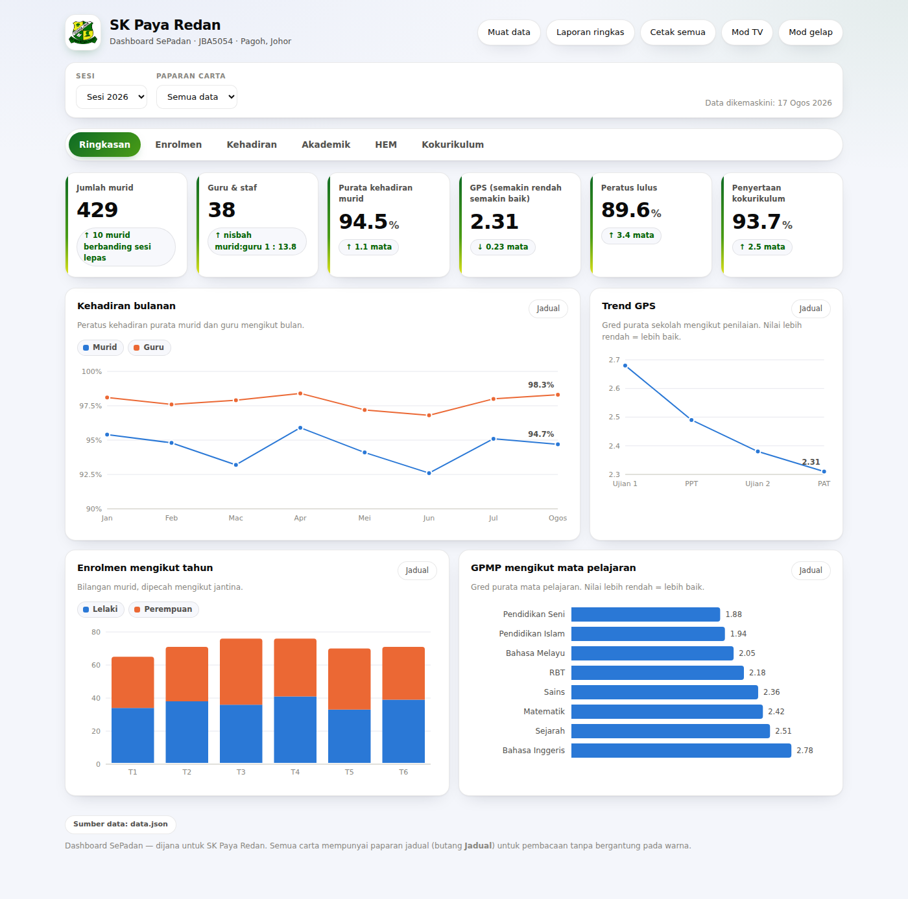
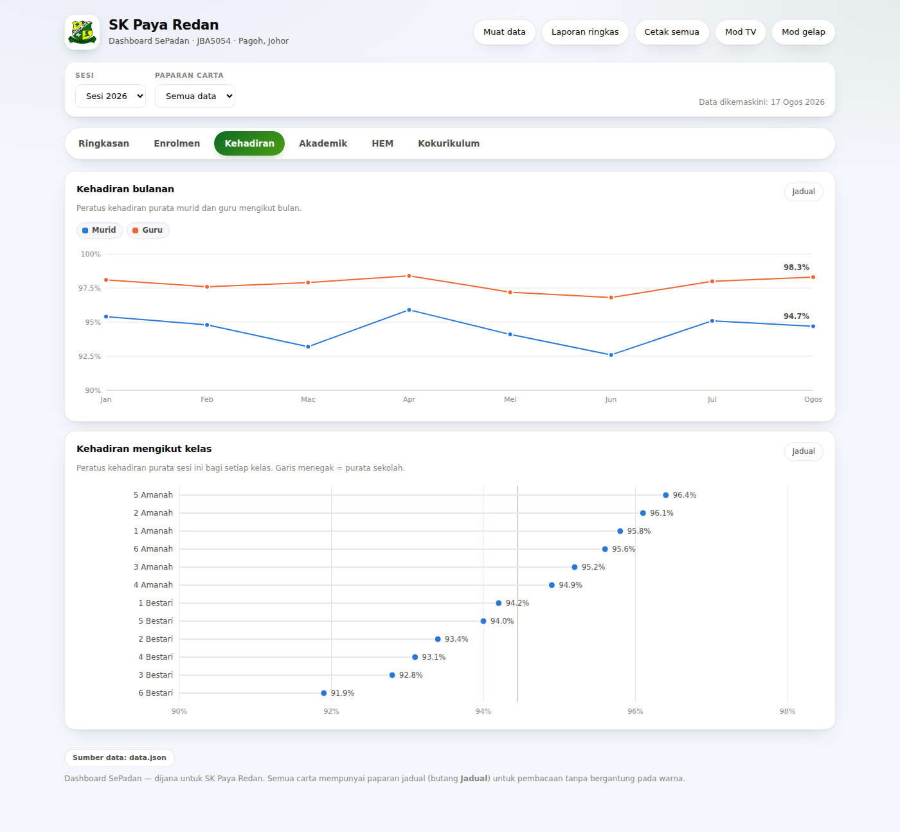
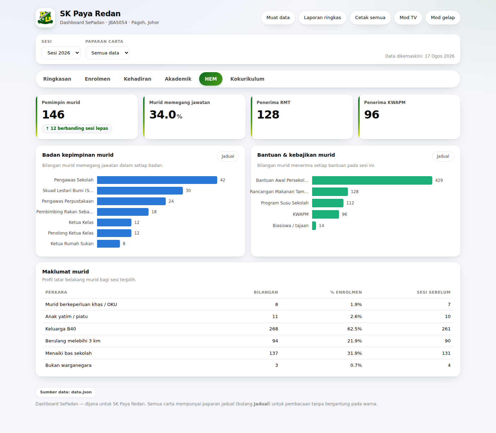
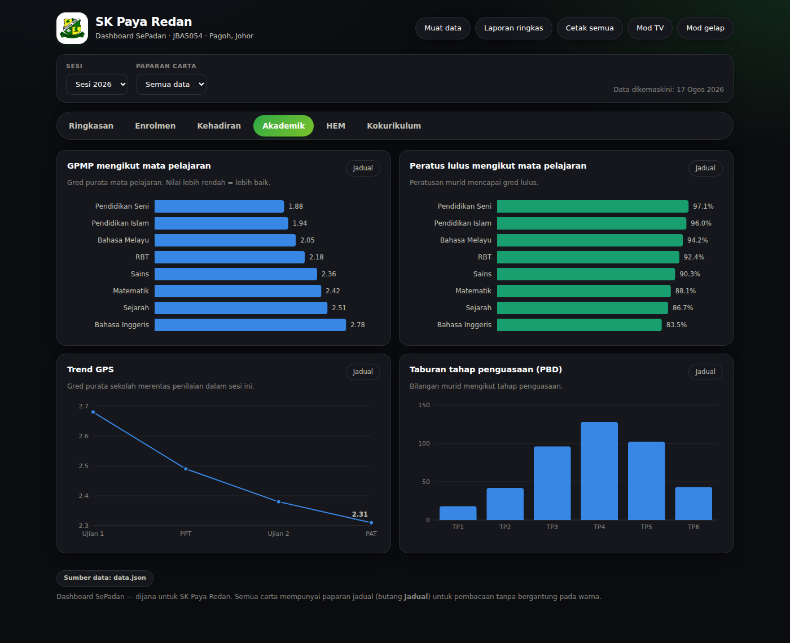
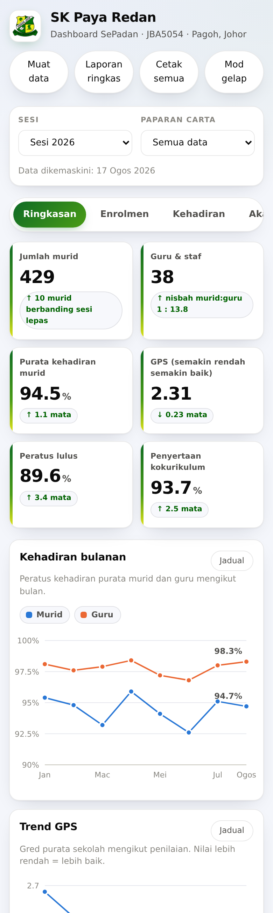
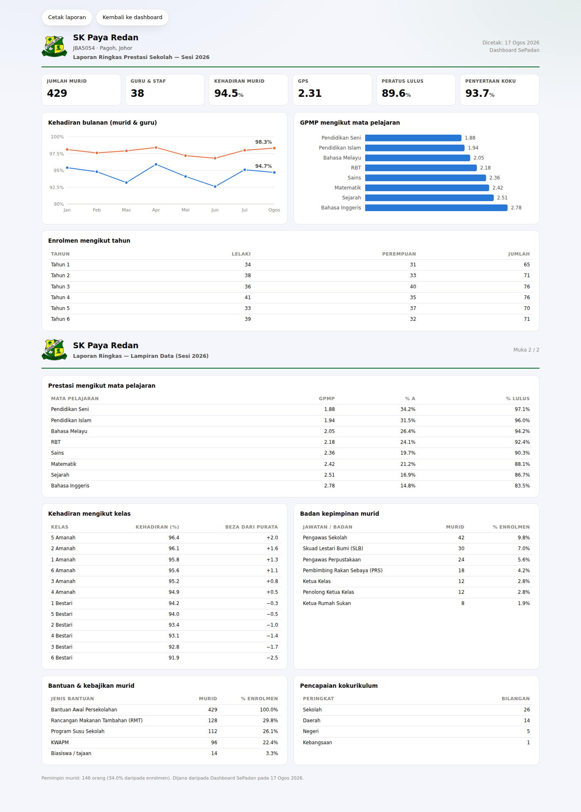

<div align="center">

# Dashboard SePadan

**Dashboard prestasi sekolah dalam satu fail HTML.**
Tiada pemasangan · Tiada pangkalan data · Berfungsi offline

Dibina untuk **SK Paya Redan (JBA5054), Pagoh, Johor**

</div>

> **📐 [BLUEPRINT.md](BLUEPRINT.md)** — seni bina penuh ekosistem: dashboard ini, sistem KEHADIRAN, SEMAK dan AKSI, kontrak data antara mereka, dan peraturan yang tidak boleh dilanggar. Baca dahulu sebelum mengubah apa-apa.

---

## Apa ini

Satu fail `index.html` yang memaparkan prestasi sekolah — enrolmen, kehadiran, akademik, HEM dan kokurikulum — dalam bentuk carta dan jadual yang kemas. Semua carta dilukis sendiri dalam SVG, jadi tiada muat turun pustaka luar, tiada internet diperlukan, dan fail boleh dihantar melalui WhatsApp atau dibawa dalam USB.

Data datang dari satu fail `data.json`. Tukar fail itu, dashboard berubah. Kod tidak perlu disentuh.



---

## Ciri

| | |
|---|---|
| **6 tab** | Ringkasan · Enrolmen · Kehadiran · Akademik · HEM · Kokurikulum |
| **Paparan jadual** | Setiap carta ada butang **Jadual** — angka penuh, tiada kebergantungan pada warna |
| **Mod TV** | Skrin penuh untuk TV bilik guru; tab bertukar sendiri setiap 20 saat |
| **Laporan ringkas** | 2 muka surat A4 sedia cetak — kepala surat, angka utama, carta dan jadual lampiran |
| **Mod gelap** | Mengikut tetapan sistem, atau ditukar secara manual |
| **Responsif** | Susun atur berubah untuk telefon, tablet dan desktop |
| **Mesra buta warna** | Palet disahkan untuk deutan, protan dan tritan pada mod cerah dan gelap |
| **Berbilang sesi** | Penapis sesi; perbandingan "berbanding sesi lepas" dikira automatik |

---

## Cara guna

### 1. Terus dari pelayar

Muat turun `index.html`, klik dua kali. Ia akan memaparkan data contoh terbina dalam.

Untuk data sebenar: klik **Muat data**, pilih fail `.json` tuan. Berfungsi sepenuhnya offline.

### 2. Dihoskan (GitHub Pages, Google Sites, pelayan sekolah)

Letak `index.html` dan `data.json` dalam folder yang sama. Dashboard memuat `data.json` secara automatik setiap kali dibuka.

### 3. Data dari sistem lain

```
index.html?data=https://sistem-sekolah.example/api/dashboard.json
```

---

## Struktur data

```jsonc
{
  "sekolah":     { "nama": "SK Paya Redan", "kod": "JBA5054", "daerah": "Pagoh, Johor" },
  "sesi_semasa": "2026",
  "sesi": {
    "2026": {
      "enrolmen":    { "ikut_tahun": [...], "ikut_kaum": [...], "guru": 31, "kelas": 12 },
      "kehadiran":   { "bulanan": [...], "ikut_kelas": [...] },
      "akademik":    { "gps": 2.31, "mata_pelajaran": [...], "trend_gps": [...], "pbd_tahap": [...] },
      "hem":         { "kepimpinan": [...], "bantuan": [...], "profil_murid": [...] },
      "kokurikulum": { "peratus_penyertaan": 93.7, "ikut_bidang": [...], "pencapaian": [...] }
    }
  }
}
```

Tambah sesi baharu = tambah satu kunci di bawah `sesi`. Tiada perubahan kod.

**Dokumentasi penuh setiap medan, beserta contoh skrip Google Apps Script untuk menjana `data.json` daripada Google Sheets: [PANDUAN-DATA.md](PANDUAN-DATA.md)**

---

## Paparan

<table>
<tr>
<td width="50%"><b>Kehadiran</b><br></td>
<td width="50%"><b>HEM</b><br></td>
</tr>
<tr>
<td><b>Mod gelap</b><br></td>
<td><b>Telefon</b><br></td>
</tr>
</table>

**Laporan ringkas** — 2 muka surat sedia cetak untuk mesyuarat guru atau PIBG:



---

## Menggunakan untuk sekolah lain

1. Ganti nilai dalam `sekolah` — nama, kod, daerah
2. Tetapkan `sekolah.logo` kepada URL atau data-URL logo sekolah tuan (logo SK Paya Redan tertanam sebagai lalai)
3. Ganti kandungan `sesi` dengan data sekolah tuan

Struktur data tidak terikat kepada mana-mana sekolah — ia mengikut bidang laporan standard sekolah rendah KPM.

---

## Teknikal

- Satu fail HTML, kira-kira 100 KB termasuk logo tertanam
- Tiada kebergantungan luar, tiada `localStorage`, tiada panggilan rangkaian selain `data.json`
- Carta: SVG yang dijana sendiri (bar, bar melintang, garis, titik, lajur bertindan)
- Palet carta mengikut kaedah yang disahkan secara berangka untuk keterlihatan buta warna dan kontras
- Diuji pada Chromium, saiz skrin 390 px hingga 1920 px

---

## Lesen

[MIT](LICENSE) — bebas digunakan, diubah suai dan diedarkan, termasuk oleh sekolah lain.

Logo SK Paya Redan adalah hak milik sekolah berkenaan dan bukan sebahagian daripada lesen MIT.
